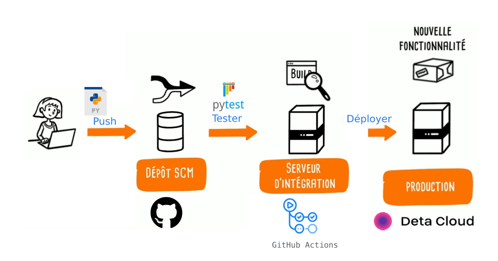
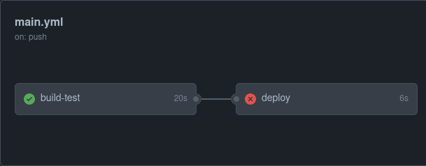
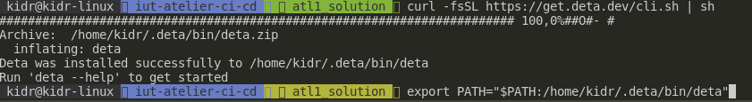

# IUT: Chaine CI/CD

@author Rxinui

## Atelier 1 : Ecoles toulousaines API JSON

Dans l'atelier 1, nous allons réaliser une chaine CI/CD qui se contentera d'**un serveur d'intégration** pour la CI et d'un **environnement de production** pour la CD.

### Pré-requis

Les technologies qui seront utilisées lors de cet atelier nécessitent :

Une installation de :

- [git](https://git-scm.com/downloads)
- [Python 3](https://www.python.org/downloads/)

Un compte utilisateur sur :

- [Github (intégration)](https://github.com/login)
- [Deta.sh (déploiement)](https://web.deta.sh/)

### Rappels: commandes utiles

- Enregistrer les modifications : `git commit -a -m "<message de commit>"`
- Pousser les modifications sur GitHub pour la 1er fois : `git push --set-upstream origin atl1_actif`
- Pousser les modifications sur GitHub : `git push`

### Code source

Le dossier `atelier/` contient le code source de l'application. N'oubliez pas de vous placez dans ce dossier dans votre chaine CI/CD pour lancer les scripts.

- `atelier/init.sh` initialise un environnement Python avec les dépendances nécessaires au bon fonctionnement de l'application
- `atelier/run.sh` démarre l'application Python dans le bon environnement
- `atelier/main.py` correspond au code source de l'application. C'est une API REST basique qui affiche quelques écoles supérieures de Toulouse.
- `atelier/ecoles.json` contient les données nécessaires au fonctionnement de l'application. Répertorie un extrait des écoles supérieures de Toulouse.

### Exercice

Intégrer et déployer une API REST écrit en Python. L'API est construit par FastAPI et permet de lister les écoles supérieures de Toulouse disponible dans notre base de données.

Dans un premier temps, on va établir une chaine CI/CD en 2 taches : `build-test` puis `deploy`.
Dans un second temps, on rajoutera une fonctionnalitée à notre API puis on vérifira que la chaine CI/CD créé est bien fonctionnelle.

#### Apercu de l'API sur la machine locale

Placer vous dans le dossier `atelier/` dans votre terminal avec la commande `cd atelier/`.

Pour démarrer votre serveur web, il faut :
1. Builder les dépendances python nécessaires (qui sont déclarées dans le fichier `requirements.txt`) avec le script `init.sh`
2. Démarrer votre serveur sur votre machine en lancant le script `run.sh`

Normalement, vous pouvez accéder localement à l'API à l'adresse [http://127.0.0.1:8000](http://127.0.0.1:8000). La page d'accueil vous renvoit un document JSON qui présente l'API. Sur cette page, vous avez la clé `routes:` qui liste toutes les routes HTTP disponibles (à la fin de l'atelier 1) de l'API.

Pour le moment, vous ne devez avoir accès qu'à la route principale qui est `/`. Si vous essayez d'accéder à la route `/ecoles` par exemple via votre navigateur, vous êtes censés voir `detail: Not Found` s'afficher.

Tuer le serveur web qui tourne sur votre machine locale en effectuant `Ctrl+C` et passons à la chaine CI ! :)
#### Partie CI

1. **TODO**: Compléter la chaine CI/CD `.github/workflows` pour qu'il se déclenche au `push` de votre branche de travail actuelle.

2. **TODO**: Écrire l'étape d'initialisation de l'environnement en se servant du script `atelier/init.sh`

3. **TODO**: Écrire l'étape de démarrage du serveur python en se servant du script `atelier/run.sh`

4. **TODO**: Écrire l'étape de test en lancant la commande `pytest` depuis le dossier `atelier/`. ([voir doc](https://docs.pytest.org/en/6.2.x/usage.html#specifying-tests-selecting-tests))

5. **TODO**: **Enregistrer les modifications et pousser les sur votre GitHub**. Regarder votre chaine CI/CD. Vous devez obtenir un succès sur le job **build-test** et un échec sur le job **deploy**.

Ce comportement est normal, car nous avons réalisé la partie CI et non la partie CD !



#### Partie CD

[Deta.sh](https://web.deta.sh/) est une solution gratuite qui permet d'héberger et builder des applications faites en Python ou NodeJS grâce à son service [Deta Micros](https://docs.deta.sh/docs/micros/getting_started/) (Micros pour Micro-serveur). Dans cet atelier, le site déployé sur la plateforme Deta sera notre site en production.

Tout comme Netlify, avant d'automatiser le déploiement sur Deta.sh, il est nécessaire de le déployer une 1er fois manuellement afin d'instancer un microserveur sur Deta.

##### Enregistrer notre projet sur Deta.sh

1. Se connecter à la [plateforme Deta.sh](https://web.deta.sh/)
2. Installer le client sur votre machine locale  en ouvrant votre console système :
- MacOS/Linux `curl -fsSL https://get.deta.dev/cli.sh | sh`

Et ajouter dans votre variable d'environnement `PATH` le chemin d'accès du paquet `deta`.



3. Lancer la commande `deta login` pour vous authentifier sur Deta.sh depuis votre machine locale.

**Note**: si une erreur apparait, il est possible que votre système ne trouve pas le path du paquet `deta`. Ajouter le chemin du paquet dans votre variable d'environnement `PATH`.

4. Lancer la commande suivante en étant positionné dans le dossier `atelier/` : `deta new --project default`. Sur votre console, vous verrez apparaître quelque chose de similaire : 

```bash
Successfully created a new micro
{
        "name": "atelier",
        "id": "02331247-43ab-4d11-a8c7-3c718ce7296c",
        "project": "a0i6xren",
        "runtime": "python3.9",
        "endpoint": "https://abcdef.deta.dev",
        "region": "eu-central-1",
        "visor": "enabled",
        "http_auth": "disabled"
}
```

5. Récupérer la valeur "endpoint" retourné par votre console (https://<nom_aleatoire>.deta.dev/). Cette URL correspond à URL de votre site en production.
6. Lancer la commande `deta deploy` qui deploiera automatiquement notre application Python.
7. Visiter l'URL de votre site en production récupérée plus tôt. À cette étape, vous pouvez uniquement accéder à la page d'accueil `/` de l'API.

Créer un **Access Tokens** sur votre compte Deta à l'URL suivante `https://web.deta.sh/home/<username>/` et copier le dans un secret GitHub (vu précédemment lors de l'atelier 0) pour l'utiliser sur deta-deploy-action.


1. **TODO**: Utiliser l'action [deta-deploy-action](https://github.com/marketplace/actions/deploy-to-deta) pour déployer l'API Python. Lire attentivement la spec de l'action pour comprendre et utiliser les paramètres nécessaires.

*Note*: la valeur `deta-project-dir` doit être `atelier/` car c'est ce dossier qui contient notre code source et le dossier caché `.deta` créé lors du `deta new`.

À présent, nous allons rajouter améliorer notre API en activant la route `/ecoles`. Cela va nous permettre de vérifier que le déploiement en production a bien fonctionné.

2. **TODO**: Décommenter les méthodes `ecoles` et `ecole_par_id` dans le fichier `atelier/main.py`. Ensuite, décommenter tous les tests dans `atelier/test_api.py`

Tester sur votre machine locale, en démarrant le script `./run.sh` : 
1. [http://127.0.0.1:8000](http://127.0.0.1:8000) doit maintenant vous permettre de : 
- lister les écoles en visitant la ressource `/ecoles`.
- lister les écoles filtrées par groupe en visitant la ressource `/ecoles?groupe={groupe}`
- afficher l'école selon un identifiant donné en visitant la ressource `/ecoles/{id}` (ie. id=4)
2. Lancer la commande `pytest` pour démarrer vos tests unitaires (intégrations)

3. **TODO**: Enregistrer les modifications et pousser les sur votre GitHub. Regarder votre chaine CI/CD. Si c'est un succès alors vérifiez que votre site en production chez Deta.sh est mis-à-jour en essayant la route `/ecoles`. Si l'API est accessible alors le déploiement est un succès sinon corrigez vos erreurs puis répétez cette étape.

Tester que tout fonctionne sur votre environnement de production : 
- lister les écoles en visitant la ressource `/ecoles`.
- lister les écoles filtrées par groupe en visitant la ressource `/ecoles?groupe={groupe}`
- afficher l'école selon un identifiant donné en visitant la ressource `/ecoles/{id}` (ie. id=4)

S'il vous est impossible d'y accéder, un problème est survenu lors du déploiement. Revoir votre chaine CI/CD.

Maintenant, rajoutant une fonctionnalitée à notre API. Vous allez coder un peu de Python cette fois (vraiment un peu) ;)

4. **TODO**: À l'aide du code source présent dans `main.py`, compléter la méthode `ajouter_ecole`.

- La méthode `ajouter_ecole` doit être déclenchée par un `HTTP GET` sur `/ecoles/new` avec les query paramètres GET `nom` (str) et `groupe` (str).
- La méthode renvoie un `dict` de l'école ajouté

5. **TODO**: Enregistrer les modifications et pousser les sur votre GitHub. Sur votre site en production (deta.sh), ajouter votre IUT comme nouvelle école.

6. **TODO**: Que se passe-t-il ? 

*That's all folks :)*