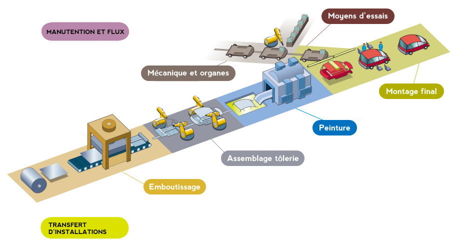
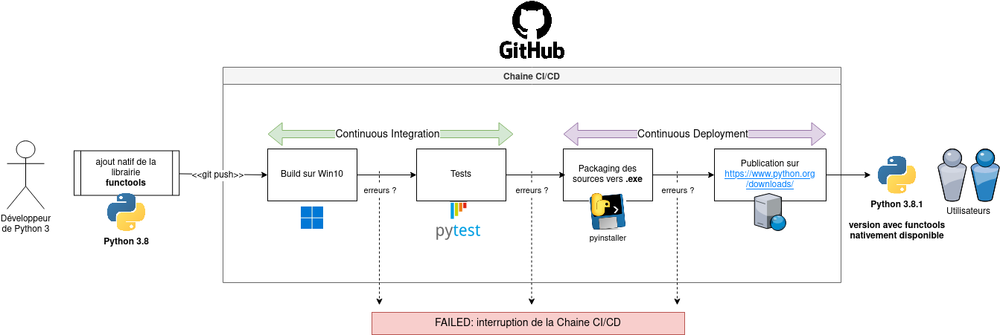

# IUT: Chaine CI/CD

@author Rxinui

## Introduction

La chaine CI/CD est une méthode - très en vogue dans le DevOps - qui consiste à délivrer continuellement un produit de manière automatisé.
On parle de :
1. **Continuous Integration** : automatiser l'imbrication de nouvelles fonctionnalités sur celles existantes.
2. **Continuous Deployment** : automatiser la publication du produit.
3. **Continuous Delivery** (hors-tuto) : automatiser la publication du produit jusqu'à un certain niveau. Le produit ne sera jamais déployé au stade final (ie. accès par l'utilisateur) sans vérification par un humain (ie. administrateur du produit). Cette intervention est requise lorsque la publication finale demande des décisions critiques et complexes. N.B: très utilisé dans le monde de l'entreprise par rapport au *Continuous Deployment*.

L'intéret de cette méthode est d'automatiser les tâches répétitives du développeur de manière centralisée par l'intégration continue et la publication automatique des mises-à-jours par le déploiement continue. Elle sert à augmenter la productivité, l'autonomie et le partage d'information au sein d'une équipe.

Articles détaillées:
- [What is CI/CD](https://www.redhat.com/en/topics/devops/what-is-ci-cd)
- [Vidéo sur CI/CD de Cookie connecté](https://www.youtube.com/watch?v=ws1qGuFMYlc)

## Explication de la chaine CI/CD

Pour comprendre le concept de la chaine CI/CD, on peut faire l'analogie de la chaine CI avec la chaine de production d'une voiture.



La voiture représente la solution logicielle développée, qui se voit rajouter des fonctionnalités au fur-et-à-mesure de l'avancement du code.
L'emboutissage, l'assemblage, la peinture et le montage final représente les étapes (*stages*) de la chaine CI.
Pour passer d'une étape à une autre (ie. de l'assemblage à la peinture), il est primordiale de s'assurer que l'assemblage soit impeccable aux moyens de tests techniques. Dans notre cas, ce sont des tests automatiques qui seront appliqués (unitaire, de scénario, de bout-en-bout, etc...)

Une fois qu'on arrive au montage final (à la finalisation d'une *feature*), on arrive au bout de la chaine CI. C'est donc la chaine CD qui prend le relais. 
La voiture (notre code) est prête à être envoyée au client. Pour cela, la voiture doit passer de l'usine de construction au dépôt de stockage, puis du dépôt de stockage vers le concessionnaire, et enfin du concessionnaire vers le client. Ces étapes servent a déployer les nouvelles fonctionnalités qui ont été testées et validées par la chaine CI vers l'environnement de production (càd, l'environnement accessible par le public, l'utilisateur final).

Prenons cette fois, un exemple appliqué à l'informatique.



Un développeur officiel de Python.org, effectue une mise à jour sur `Python 3.8` afin d'ajouter la librairie `functools` nativement.

1. Le développeur pousse sa branche git sur le github officiel du projet
2. Le github du projet possède une chaine CI/CD composée de 4 étapes automatisées : build, tests, packaging et publication.
3. Le `push` effectué par le développeur déclenche la 1er étape de la chaine.
4. L'étape **build** consiste à récuperer le code source qui a été poussé et d'installer les packages nécessaires sur l'environnement sur un serveur de type Windows. (ie. l'interpréteur Python, le code source sur GitHub, les dépendances Pythons, etc...)
5. Si aucune erreur est détectée (ie. Exception Python, plantage Windows, ...) alors on procéde à l'étape **tests** sinon, la chaine CI plante.
6. L'étape **tests** consiste à lancer les tests unitaires Python qui assurent le bon fonctionnement de l'ancien code source mais aussi celui de l'ajout, sur l'environnement initialisé par l'étape **build**.
7. Si tous les tests passent alors la chaine CI est terminé et on bascule sur le CD avec l'étape de **packaging** sinon, un problème est survenu et la chaine CI plante.
8. L'étape **packaging** consiste à transformer le code source en fichier exécutable *.exe* destiné à l'utilisateur final.
9. Si aucune erreur survient lors de la transformation alors on procéde à l'étape finale **publication** sinon, la chaine CD plante.
10. L'étape **publication** consiste à mettre en ligne automatiquement le fichier exécutable créé à l'étape précédente sur le serveur [python.org](https://www.python.org/downloads/), qui sera à disposition de tous sous la version `Python 3.8.1`.

Par cette méthode CI/CD, le développeur n'a eu à se soucier uniquement du développement de sa fonctionnalité car c'est la chaine CI/CD qui est responsable des tests et du déploiement du produit.

## Ateliers

Les ateliers illustrent la mise en place une chaine CI/CD simple à l'aide d'outils gratuit et utilisé dans le monde de l'entreprise / projet personnel.

### Pré-requis

Les technologies qui seront utilisées lors de ces ateliers nécessitent:

Une installation de :
- [git](https://git-scm.com/downloads)
- [Python 3](https://www.python.org/downloads/)
- [Docker](https://docs.docker.com/engine/install/#supported-platforms) (atelier 2)

Un compte utilisateur sur :
- [Github (intégration)](https://github.com/login)
- [Netlify (déploiement)](https://app.netlify.com/) (atelier 0)
- [Deta.sh (déploiement)](https://web.deta.sh/) (atelier 1)
- [Docker Hub (repository)](https://hub.docker.com/) (atelier 2)

### Choix d'atelier

Pour commencer un atelier, il est nécessaire de forker le projet. Cliquer sur **Fork** (en haut à droite) et choisissez votre compte. Cela permet de cloner mon repo GitHub sur votre compte personnel.

Cloner le votre repository forké sur votre compte GitHub sur votre machine locale en cliquant sur **Code**. Copier-coller l'URL qui est apparue et lancer sur votre machine la commande suivante : 

```bash
git clone <url-copiée>
```

Pour séléctionner et débuter un atelier, veuillez lancer une des commandes indiquées ci-dessous.

0. Tutoriel: Hello world of CI/CD

```bash
git checkout -b atl0_actif origin/atl0
```

1. Debutant: Ecoles toulousaines API Json

```bash
git checkout -b atl1_actif origin/atl1
```

2. Intermédiaire: Play with Docker (Non-terminé: version démo ?)

```bash
git checkout -b atl2_actif origin/atl2
```